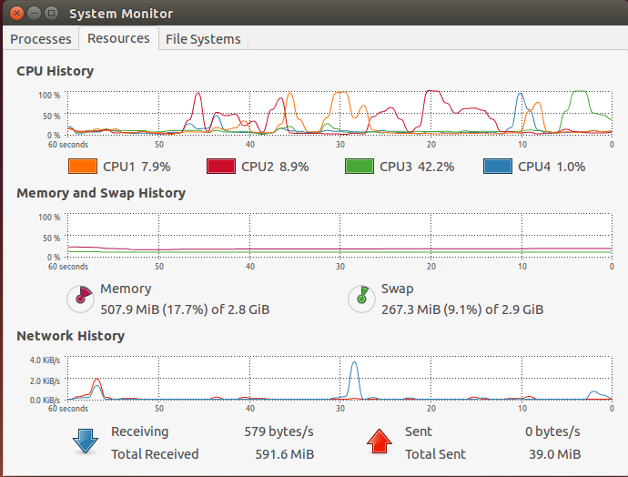
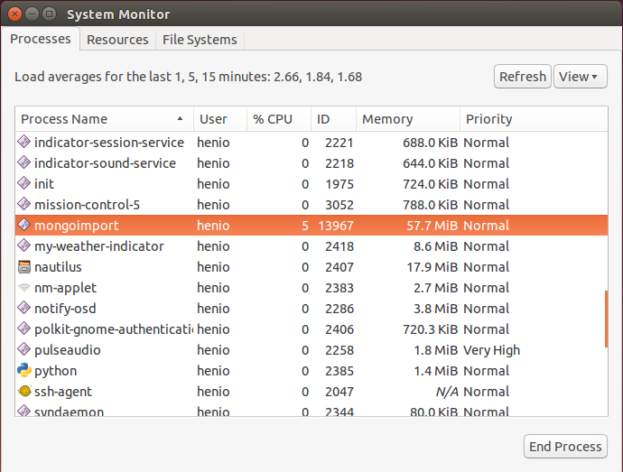
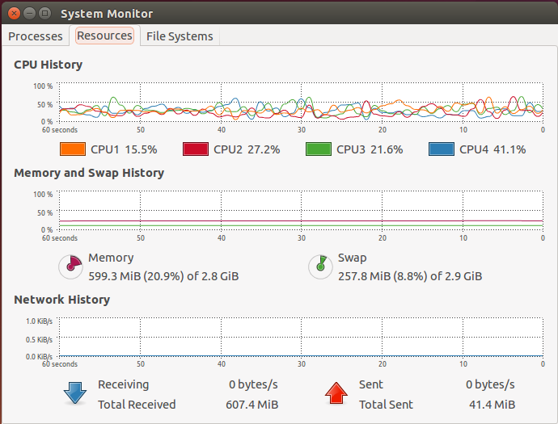
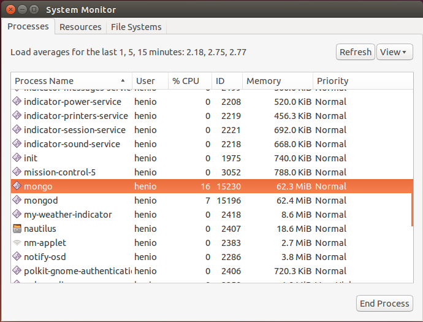

# Daniel Sienkiewicz (206358) NoSQL - MongoDB

* [Komputer](#Komputer)
* [Zadanie 1a](#1a)
* [Zadanie 1b](#1b)
* [Zadanie 1c](#1c)
* [Zadanie 1e](#1e)

## Komputer
* Computer: Toshiba C650 - 1C2
* CPU: Intel® Core™ i3 CPU M 350 @ 2.27GHz × 4 
* RAM: 3,072 (2,048 + 1,024) MB, DDR3 RAM (1066 MHz)
* Disk: 320 GB, 5,400 r/min
* OS: Ubuntu 14.04 LTS x64
* Data base: MongoDB version: 2.6.4

## 1a
Zadanie 1a polega na zaimportowaniu, do systemów baz danych uruchomionych na swoim komputerze, danych z pliku Train.csv bazy:

* MongoDB
* PostgreSQL

Odp:
Przed importem należy "naprawić" plik Train.csv (za pomocą skryptu [naprawa.sh](https://github.com/henio180/NoSQL/blob/master/scripts/naprawa.sh))
~~~
$ time ./naprawa.sh Train.csv naprawionyTrain.csv
real 12m6.155s
user 0m46.461s
sys 2m8.678s
~~~

Następnie import pliku
~~~
$ time mongoimport -c train --type csv --file /media/Data/naprawionyTrain.csv  --headerline --dbpath /home/henio/mongodata/
real 8m15.141s
user 3m58.573s
sys 0m22.813s
~~~

Pamięć orac CPU:

## 1b
Zliczyć liczbę zaimportowanych rekordów (Odpowiedź: powinno ich być 6_034_195).

Odp:
~~~
> db.train.count()
6034195

real 0m0.067s
user 0m0.059s
sys 0m0.008s
~~~

## 1c
(Zamiana formatu danych.) Zamienić string zawierający tagi na tablicę napisów z tagami następnie zliczyć wszystkie tagi i wszystkie różne tagi.

W tym zadaniu należy napisać program, który to zrobi. W przypadku MongoDB należy użyć jednego ze sterowników ze  strony MongoDB Ecosystem. W przypadku PostgreSQL – należy to zrobić w jakikolwiek sposób.

Odp: Wszystkie oraz unikale tagi są zliczane przez skrypt napisany w języku JavaScript ([tags.js](https://github.com/henio180/NoSQL/blob/master/scripts/tags.js))
~~~
$ time mongo scripts/tags.js

Wszystkie: 17409994
Unikalne: 42048

real 100m53.022s
user 59m35.977s
sys 4m22.558s
~~~

Przykłady tagów, które wystąpiły tylko RAZ:
~~~
*qset
*cportlet
*django-inlinecss
*jaegermonkey
*qdbusxml2cpp
*imapclient
*flexclone
*cftree
*fpcunit
*journald
*regex-injection
*alsolanguage
*lsusb
*multi-focal
*pm-utils
*false-flag
*candelight
*distributed-storage
~~~

Przed zmianą:
~~~
> db.train.findOne()
{
	"_id" : 1,
	"title" : "How to check if an uploaded file is an image without mime type?",
	"body" : "
I'd like to check if an uploaded file is an image file (e.g png, jpg, jpeg, gif, bmp) or another file. The problem is that I'm using Uploadify to upload the files, which changes the mime type and gives a 'text/octal' or something as the mime type, no matter which file type you upload.
  
Is there a way to check if the uploaded file is an image apart from checking the file extension using PHP?
 ",
	"tags" : "php image-processing file-upload upload mime-types
}
~~~

Po zmianie:
~~~
> db.train.findOne()
{
	"_id" : 1,
	"title" : "How to check if an uploaded file is an image without mime type?",
	"body" : "
I'd like to check if an uploaded file is an image file (e.g png, jpg, jpeg, gif, bmp) or another file. The problem is that I'm using Uploadify to upload the files, which changes the mime type and gives a 'text/octal' or something as the mime type, no matter which file type you upload.
  
Is there a way to check if the uploaded file is an image apart from checking the file extension using PHP?
 ",
	"tags" : [
		"php",
		"image-processing",
		"file-upload",
		"upload",
		"mime-types"
	]
}
~~~

Pamięć orac CPU:

## 1e
Wyszukać w sieci dane zawierające obiekty GeoJSON. Następnie dane zapisać w bazie MongoDB.

Dla zapisanych danych przygotować co najmniej 6 różnych geospatial queries (w tym, co najmniej po jednym, dla obiektów Point, LineString i Polygon).

Odp: Mapa opisana za pomocą GEOJSON znajduje się w pliku [mapa.geojson](https://github.com/henio180/NoSQL/blob/master/mapa.geojson). Pokazuje ona miejsca, które zwiedziłem.
~~~
$ time mongoimport -db mapa --collection map < mapa.geojson
~~~