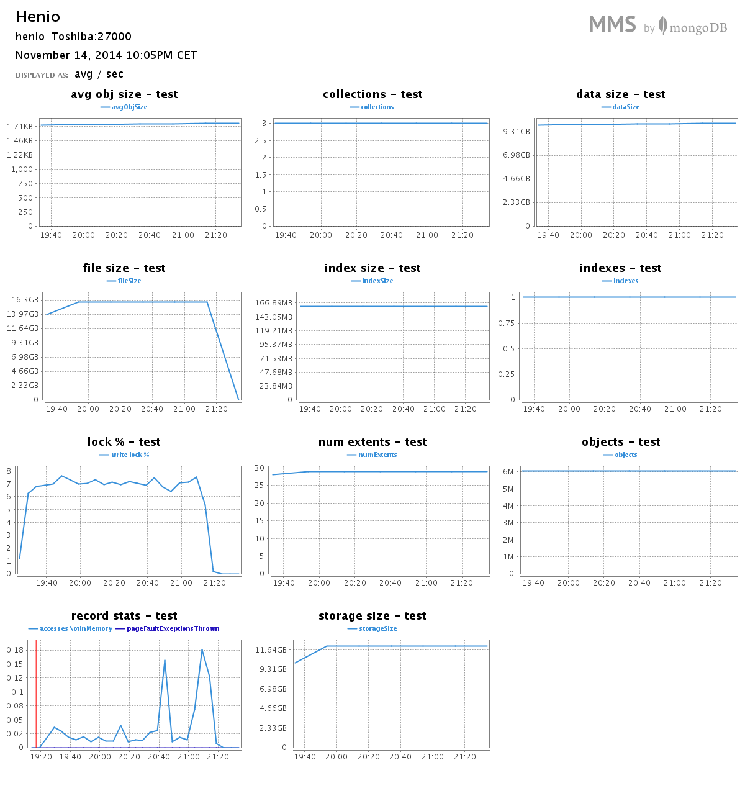

# Daniel Sienkiewicz (206358) NoSQL - MongoDB

* [Komputer](#Komputer)
* [Mongo MMS](#MMS)
* [Dane odnośnie bazy](#Dane odnośnie bazy)
* [Zadanie 1a](#1a)
* [Zadanie 1b](#1b)
* [Zadanie 1c](#1c)
* [Zadanie 1d](#1d)
* [Uwagi na temat nowej wersji Mongo](#Uwagi na temat nowej wersji Mongo)
* [Zadanie 2](#2)

## Komputer
* Computer: Toshiba C650 - 1C2
* CPU: Intel® Core™ i3 CPU M 350 @ 2.27GHz × 4 
* RAM: 3,072 (2,048 + 1,024) MB, DDR3 RAM (1066 MHz)
* Disk: 320 GB, 5,400 r/min
* OS: Ubuntu 14.04 LTS x64
* Data base: MongoDB version: 2.6.5, MongoDB version: 2.8.0 rc0 

## MMS
Do bazy danych został podpięty system [Mongo MMS](http://mms.mongodb.com):

* username: sienkiewicz@project-midas.com
* group: Henio

## Dane odnośnie bazy

## 1a
Zadanie 1a polega na zaimportowaniu, do systemów baz danych uruchomionych na swoim komputerze, danych z pliku Train.csv bazy:

* MongoDB
* PostgreSQL

Odp:
Przed importem należy "naprawić" plik Train.csv (za pomocą skryptu [naprawa.sh](https://github.com/henio180/NoSQL/blob/master/scripts/naprawa.sh))
~~~
$ time ./naprawa.sh Train.csv naprawionyTrain.csv
real 12m6.155s
user 0m46.461s
sys 2m8.678s
~~~

Następnie import pliku dla MongoDB 2.6.5
~~~
$ time mongoimport -c train --type csv --file /media/Data/naprawionyTrain.csv --headerline --dbpath /home/henio/mongodata/
real 8m15.141s
user 3m58.573s
sys 0m22.813s
~~~

Pamięć orac CPU:

Następnie import pliku dla MongoDB 2.8.0 rc0
~~~
$ time mongoimport -c train --type csv --file /media/Data/naprawionyTrain.csv  --headerline --dbpath /home/henio/mongodata/
real	9m17.431s
user	4m1.100s
sys	0m24.152s
~~~

Pamięć orac CPU:

Dla PostgreSQL - przed importem należy usunąć pierwszą linię zawierającą nagłowek CSV
~~~
sed '1d' naprawionyTrain.csv > naprawionyTrain1.csv 
~~~

Stworzenie tabeli oraz import pliku do bazy PostgreSQL
~~~
CREATE TABLE tra (id int, title varchar(255), body varchar(10485760), tags varchar(10000));
COPY tra FROM '/home/henio/naprawionyTrain1.csv' DELIMITER ',' CSV;

real 9m44.445s
user 0m0.48s
sys 0m0.032s
~~~

Pamięć orac CPU:

## 1b
Zliczyć liczbę zaimportowanych rekordów (Odpowiedź: powinno ich być 6_034_195).

Odp dla MongoDB 2.6.5
~~~
> db.train.count()
6034195

real 0m0.067s
user 0m0.059s
sys 0m0.008s
~~~

Odp dla MongoDB 2.8.0 rc0
~~~
> db.train.count()
6034195

real	0m1.350s
user	0m0.057s
sys	0m0.026s
~~~

Odp dla PostgreSQL
~~~
postgres=# select count (*) from tra;
  count  
---------
 6034195
(1 row)

real	5m14.991s
user	0m0.050s
sys	0m0.040s
~~~

## 1c
(Zamiana formatu danych.) Zamienić string zawierający tagi na tablicę napisów z tagami następnie zliczyć wszystkie tagi i wszystkie różne tagi.

W tym zadaniu należy napisać program, który to zrobi. W przypadku MongoDB należy użyć jednego ze sterowników ze  strony MongoDB Ecosystem. W przypadku PostgreSQL – należy to zrobić w jakikolwiek sposób.

Odp dla MongoDB 2.6.5:
~~~
$ time mongo scripts/tags.js

Wszystkie: 17409994
Unikalne: 42048

real 100m53.022s
user 59m35.977s
sys 4m22.558s
~~~

Pamięć orac CPU:

Odp dla MongoDB 2.8.0 rc0:
~~~
$ time mongo scripts/tags.js

Wszystkie: 17409994
Unikalne: 42048

real	109m36.350s
user	56m33.976s
sys	4m32.039s
~~~

Pamięć orac CPU:

Wszystkie oraz unikale tagi są zliczane przez skrypt napisany w języku JavaScript ([tags.js](https://github.com/henio180/NoSQL/blob/master/scripts/tags.js)). Przykłady tagów, które wystąpiły tylko RAZ:
~~~
*qset
*cportlet
*django-inlinecss
*jaegermonkey
*qdbusxml2cpp
*imapclient
*flexclone
*cftree
*fpcunit
*journald
*regex-injection
*alsolanguage
*lsusb
*multi-focal
*pm-utils
*false-flag
*candelight
*distributed-storage
~~~

Przed zmianą:
~~~
> db.train.findOne()
{
	"_id" : 1,
	"title" : "How to check if an uploaded file is an image without mime type?",
	"body" : "
I'd like to check if an uploaded file is an image file (e.g png, jpg, jpeg, gif, bmp) or another file. The problem is that I'm using Uploadify to upload the files, which changes the mime type and gives a 'text/octal' or something as the mime type, no matter which file type you upload.
  
Is there a way to check if the uploaded file is an image apart from checking the file extension using PHP?
 ",
	"tags" : "php image-processing file-upload upload mime-types
}
~~~

Po zmianie:
~~~
> db.train.findOne()
{
	"_id" : 1,
	"title" : "How to check if an uploaded file is an image without mime type?",
	"body" : "
I'd like to check if an uploaded file is an image file (e.g png, jpg, jpeg, gif, bmp) or another file. The problem is that I'm using Uploadify to upload the files, which changes the mime type and gives a 'text/octal' or something as the mime type, no matter which file type you upload.
  
Is there a way to check if the uploaded file is an image apart from checking the file extension using PHP?
 ",
	"tags" : [
		"php",
		"image-processing",
		"file-upload",
		"upload",
		"mime-types"
	]
}
~~~

## 1d
Wyszukać w sieci dane zawierające obiekty GeoJSON. Następnie dane zapisać w bazie MongoDB.

Dla zapisanych danych przygotować co najmniej 6 różnych geospatial queries (w tym, co najmniej po jednym, dla obiektów Point, LineString i Polygon).

Odp: Mapa opisana za pomocą GEOJSON znajduje się w pliku [mapa.geojson](mapy/mapa.geojson). Pokazuje ona miejsca, które zwiedziłem.

~~~
$ time mongoimport -db mapa --collection map < mapa.json 
connected to: 127.0.0.1
2014-10-18T12:59:28.818+0200 check 9 50
2014-10-18T12:59:28.818+0200 imported 50 objects

real	0m0.117s
user	0m0.008s
sys	0m0.019s
~~~

Przykładowy rekord:
~~~
> db.map.findOne()
{
	"_id" : ObjectId("544bf24f6211523c46759481"),
	"loc" : {
		"type" : "Point",
		"coordinates" : [
			16.068878173828125,
			51.50190410761811
		]
	}
}
~~~

Na początku dodajemy geo-indeks do rekordów:
~~~
> db.map.ensureIndex({"loc" : "2dsphere"})
~~~

Zapytanie z użyciem "POLYGON"
~~~
> db.map.find( { loc : { $geoWithin : { $polygon : [[ 15.62530517578125, 51.60266574567799 ], [ 16.2322998046875, 51.84765608216451 ], [ 16.8365478515625, 51.49677467073002 ], [ 15.836791992187498, 51.15867686442365 ], [ 15.62530517578125, 51.60266574567799 ]]}}})

{ "_id" : ObjectId("5442a726523687b8da3e0b88"), "loc" : { "type" : "Point", "coordinates" : [ 16.068878173828125, 51.50190410761811 ] } }
{ "_id" : ObjectId("5442a726523687b8da3e0b89"), "loc" : { "type" : "Point", "coordinates" : [ 16.200714111328125, 51.394064665922045 ] } }
{ "_id" : ObjectId("5442a726523687b8da3e0b8b"), "loc" : { "type" : "Point", "coordinates" : [ 15.893096923828125, 51.4171945605445 ] } }
{ "_id" : ObjectId("5442a726523687b8da3e0b8c"), "loc" : { "type" : "Point", "coordinates" : [ 15.77911376953125, 51.53096001302977 ] } }
{ "_id" : ObjectId("5442a726523687b8da3e0b8d"), "loc" : { "type" : "Point", "coordinates" : [ 16.431427001953125, 51.415481636209535 ] } }
{ "_id" : ObjectId("5442a726523687b8da3e0b8e"), "loc" : { "type" : "Point", "coordinates" : [ 16.224746704101562, 51.50147667659363 ] } }
{ "_id" : ObjectId("5442a726523687b8da3e0ba8"), "loc" : { "type" : "Point", "coordinates" : [ 16.08123779296875, 51.66488962182642 ] } }
~~~

[Wynik](mapy/1d_1.geojson):

Zapytanie z użyciem "POLYGON"
~~~
> db.map.find( { loc : { $geoWithin : { $polygon : [[ 17.742919921875, 54.97446103959508 ], [ 19.05029296875, 54.892405720815276 ], [ 19.0118408203125, 54.0690593387285 ], [ 17.127685546875, 54.02713344412544 ], [ 17.742919921875, 54.97446103959508 ]]}}})

{ "_id" : ObjectId("5442a726523687b8da3e0b95"), "loc" : { "type" : "Point", "coordinates" : [ 18.65478515625, 54.34374993587144 ] } }
{ "_id" : ObjectId("5442a726523687b8da3e0b96"), "loc" : { "type" : "Point", "coordinates" : [ 18.80859375, 54.61661705439048 ] } }
{ "_id" : ObjectId("5442a726523687b8da3e0b97"), "loc" : { "type" : "Point", "coordinates" : [ 18.31146240234375, 54.826007999094955 ] } }
{ "_id" : ObjectId("5442a726523687b8da3e0bb0"), "loc" : { "type" : "Point", "coordinates" : [ 18.244857788085938, 54.60667587855266 ] } }
{ "_id" : ObjectId("5442a726523687b8da3e0bb1"), "loc" : { "type" : "Point", "coordinates" : [ 18.56689453125, 54.44049878413806 ] } }
{ "_id" : ObjectId("5442a726523687b8da3e0bb2"), "loc" : { "type" : "Point", "coordinates" : [ 18.538742065429684, 54.51271147912779 ] } }
{ "_id" : ObjectId("5442a726523687b8da3e0bb3"), "loc" : { "type" : "Point", "coordinates" : [ 18.408966064453125, 54.796726693981796 ] } }
{ "_id" : ObjectId("5442a726523687b8da3e0bb4"), "loc" : { "type" : "Point", "coordinates" : [ 18.21121215820312, 54.83194081210015 ] } }
{ "_id" : ObjectId("5442a726523687b8da3e0bb5"), "loc" : { "type" : "Point", "coordinates" : [ 18.41033935546875, 54.72045628479659 ] } }
~~~

[Wynik](mapy/1d_2.geojson):

Zapytanie z użyciem "POINT" oraz "$near". Miasta leżące od najbliższego do najdalszego do Polkowic:
~~~
var origin = {type: "Point", coordinates: [51.5019, 16.0689]}
> db.map.find({ loc: {$near: {$geometry: origin}} })
~~~

Wynik
~~~
{ "_id" : ObjectId("544bdbc5c3b92a36a1b1fceb"), "loc" : { "type" : "Point", "coordinates" : [ 19.955291748046875, 49.29199347427707 ] } }
{ "_id" : ObjectId("544bdbc5c3b92a36a1b1fcf6"), "loc" : { "type" : "Point", "coordinates" : [ 20.065155029296875, 49.98037086399746 ] } }
{ "_id" : ObjectId("544bdbc5c3b92a36a1b1fcec"), "loc" : { "type" : "Point", "coordinates" : [ 19.94842529296875, 50.055375373800004 ] } }
{ "_id" : ObjectId("544bdbc5c3b92a36a1b1fced"), "loc" : { "type" : "Point", "coordinates" : [ 19.06951904296875, 49.829124584847854 ] } }
{ "_id" : ObjectId("544bdbc5c3b92a36a1b1fcf5"), "loc" : { "type" : "Point", "coordinates" : [ 19.241180419921875, 50.04302974380058 ] } }
{ "_id" : ObjectId("544bdbc5c3b92a36a1b1fce3"), "loc" : { "type" : "Point", "coordinates" : [ 21.02783203125, 52.24125614966341 ] } }
{ "_id" : ObjectId("544bdbc5c3b92a36a1b1fcfe"), "loc" : { "type" : "Point", "coordinates" : [ 21.595001220703125, 53.0816522833116 ] } }
{ "_id" : ObjectId("544bdbc5c3b92a36a1b1fcea"), "loc" : { "type" : "Point", "coordinates" : [ 17.04254150390625, 51.11386850819646 ] } }
{ "_id" : ObjectId("544bdbc5c3b92a36a1b1fcfc"), "loc" : { "type" : "Point", "coordinates" : [ 17.049407958984375, 51.303145259199056 ] } }
{ "_id" : ObjectId("544bdbc5c3b92a36a1b1fcf9"), "loc" : { "type" : "Point", "coordinates" : [ 16.195220947265625, 51.054344119247425 ] } }
{ "_id" : ObjectId("544bdbc5c3b92a36a1b1fcee"), "loc" : { "type" : "Point", "coordinates" : [ 15.838165283203125, 50.79551936692376 ] } }
{ "_id" : ObjectId("544bdbc5c3b92a36a1b1fcef"), "loc" : { "type" : "Point", "coordinates" : [ 15.761260986328123, 50.77750399573788 ] } }
{ "_id" : ObjectId("544bdbc5c3b92a36a1b1fcfb"), "loc" : { "type" : "Point", "coordinates" : [ 15.605392456054686, 50.723850912487684 ] } }
{ "_id" : ObjectId("544bdbc5c3b92a36a1b1fcd9"), "loc" : { "type" : "Point", "coordinates" : [ 16.171875, 51.19827878319755 ] } }
{ "_id" : ObjectId("544bdbc5c3b92a36a1b1fcdc"), "loc" : { "type" : "Point", "coordinates" : [ 16.431427001953125, 51.415481636209535 ] } }
{ "_id" : ObjectId("544bdbc5c3b92a36a1b1fcdf"), "loc" : { "type" : "Point", "coordinates" : [ 15.733795166015623, 50.90130070888041 ] } }
{ "_id" : ObjectId("544bdbc5c3b92a36a1b1fcf0"), "loc" : { "type" : "Point", "coordinates" : [ 15.432701110839844, 50.72558962783843 ] } }
{ "_id" : ObjectId("544bdbc5c3b92a36a1b1fce0"), "loc" : { "type" : "Point", "coordinates" : [ 15.533294677734377, 50.834564997026845 ] } }
{ "_id" : ObjectId("544bdbc5c3b92a36a1b1fcd8"), "loc" : { "type" : "Point", "coordinates" : [ 16.200714111328125, 51.394064665922045 ] } }
{ "_id" : ObjectId("544bdbc5c3b92a36a1b1fcdd"), "loc" : { "type" : "Point", "coordinates" : [ 16.224746704101562, 51.50147667659363 ] } }
{ "_id" : ObjectId("544bdbc5c3b92a36a1b1fcfa"), "loc" : { "type" : "Point", "coordinates" : [ 17.60284423828125, 52.52624809700062 ] } }
{ "_id" : ObjectId("544bdbc5c3b92a36a1b1fce9"), "loc" : { "type" : "Point", "coordinates" : [ 16.58935546875, 51.851049381288874 ] } }
{ "_id" : ObjectId("544bdbc5c3b92a36a1b1fcf4"), "loc" : { "type" : "Point", "coordinates" : [ 14.4580078125, 50.08886893382965 ] } }
{ "_id" : ObjectId("544bdbc5c3b92a36a1b1fcd7"), "loc" : { "type" : "Point", "coordinates" : [ 16.068878173828125, 51.50190410761811 ] } }
{ "_id" : ObjectId("544bdbc5c3b92a36a1b1fcda"), "loc" : { "type" : "Point", "coordinates" : [ 15.893096923828125, 51.4171945605445 ] } }
{ "_id" : ObjectId("544bdbc5c3b92a36a1b1fcf7"), "loc" : { "type" : "Point", "coordinates" : [ 16.08123779296875, 51.66488962182642 ] } }
{ "_id" : ObjectId("544bdbc5c3b92a36a1b1fcde"), "loc" : { "type" : "Point", "coordinates" : [ 15.571746826171873, 51.26535213392538 ] } }
{ "_id" : ObjectId("544bdbc5c3b92a36a1b1fcdb"), "loc" : { "type" : "Point", "coordinates" : [ 15.77911376953125, 51.53096001302977 ] } }
{ "_id" : ObjectId("544bdbc5c3b92a36a1b1fce2"), "loc" : { "type" : "Point", "coordinates" : [ 16.9134521484375, 52.41247205962487 ] } }
{ "_id" : ObjectId("544bdbc5c3b92a36a1b1fcf8"), "loc" : { "type" : "Point", "coordinates" : [ 16.0675048828125, 51.879882095410224 ] } }
{ "_id" : ObjectId("544bdbc5c3b92a36a1b1fcfd"), "loc" : { "type" : "Point", "coordinates" : [ 15.13092041015625, 51.645294049305406 ] } }
{ "_id" : ObjectId("544bdbc5c3b92a36a1b1fce4"), "loc" : { "type" : "Point", "coordinates" : [ 18.65478515625, 54.34374993587144 ] } }
{ "_id" : ObjectId("544bdbc5c3b92a36a1b1fd00"), "loc" : { "type" : "Point", "coordinates" : [ 18.56689453125, 54.44049878413806 ] } }
{ "_id" : ObjectId("544bdbc5c3b92a36a1b1fce5"), "loc" : { "type" : "Point", "coordinates" : [ 18.80859375, 54.61661705439048 ] } }
{ "_id" : ObjectId("544bdbc5c3b92a36a1b1fd01"), "loc" : { "type" : "Point", "coordinates" : [ 18.538742065429684, 54.51271147912779 ] } }
{ "_id" : ObjectId("544bdbc5c3b92a36a1b1fce1"), "loc" : { "type" : "Point", "coordinates" : [ 14.714813232421877, 51.9493437994359 ] } }
{ "_id" : ObjectId("544bdbc5c3b92a36a1b1fcff"), "loc" : { "type" : "Point", "coordinates" : [ 18.244857788085938, 54.60667587855266 ] } }
{ "_id" : ObjectId("544bdbc5c3b92a36a1b1fd04"), "loc" : { "type" : "Point", "coordinates" : [ 18.41033935546875, 54.72045628479659 ] } }
{ "_id" : ObjectId("544bdbc5c3b92a36a1b1fd02"), "loc" : { "type" : "Point", "coordinates" : [ 18.408966064453125, 54.796726693981796 ] } }
{ "_id" : ObjectId("544bdbc5c3b92a36a1b1fce6"), "loc" : { "type" : "Point", "coordinates" : [ 18.31146240234375, 54.826007999094955 ] } }
{ "_id" : ObjectId("544bdbc5c3b92a36a1b1fd03"), "loc" : { "type" : "Point", "coordinates" : [ 18.21121215820312, 54.83194081210015 ] } }
{ "_id" : ObjectId("544bdbc5c3b92a36a1b1fce7"), "loc" : { "type" : "Point", "coordinates" : [ 17.55615234375, 54.7595009150459 ] } }
{ "_id" : ObjectId("544bdbc5c3b92a36a1b1fd08"), "loc" : { "type" : "Point", "coordinates" : [ 15.047149658203125, 54.08356229415844 ] } }
{ "_id" : ObjectId("544bdbc5c3b92a36a1b1fcf3"), "loc" : { "type" : "Point", "coordinates" : [ 9.173583984375, 48.777912755501845 ] } }
{ "_id" : ObjectId("544bdbc5c3b92a36a1b1fd07"), "loc" : { "type" : "Point", "coordinates" : [ 9.010162353515623, 48.68370757165361 ] } }
{ "_id" : ObjectId("544bdbc5c3b92a36a1b1fce8"), "loc" : { "type" : "Point", "coordinates" : [ 14.271240234375, 53.89300986395707 ] } }
{ "_id" : ObjectId("544bdbc5c3b92a36a1b1fd06"), "loc" : { "type" : "Point", "coordinates" : [ 10.543441772460938, 52.16171821254618 ] } }
{ "_id" : ObjectId("544bdbc5c3b92a36a1b1fd05"), "loc" : { "type" : "Point", "coordinates" : [ 10.53314208984375, 52.26311463698559 ] } }
{ "_id" : ObjectId("544bdbc5c3b92a36a1b1fcf2"), "loc" : { "type" : "Point", "coordinates" : [ 9.7613525390625, 52.3755991766591 ] } }
{ "_id" : ObjectId("544bdbc5c3b92a36a1b1fcf1"), "loc" : { "type" : "Point", "coordinates" : [ 10.0030517578125, 53.54030739150022 ] } }
~~~

Zapytanie z użyciem "$geoWithin" oraz "$center".
Wszystkie miasta w promieniu 45° od Bielska-Białęj włącznie.
~~~
> db.map.find({loc: {$geoWithin: {$center: [[49.9804, 20.0652], 45]}}})
{ "_id" : ObjectId("544bf2506211523c4675948d"), "loc" : { "type" : "Point", "coordinates" : [ 21.02783203125, 52.24125614966341 ] } }
{ "_id" : ObjectId("544bf2506211523c46759495"), "loc" : { "type" : "Point", "coordinates" : [ 19.955291748046875, 49.29199347427707 ] } }
{ "_id" : ObjectId("544bf2506211523c46759496"), "loc" : { "type" : "Point", "coordinates" : [ 19.94842529296875, 50.055375373800004 ] } }
{ "_id" : ObjectId("544bf2506211523c46759497"), "loc" : { "type" : "Point", "coordinates" : [ 19.06951904296875, 49.829124584847854 ] } }
{ "_id" : ObjectId("544bf2506211523c4675949f"), "loc" : { "type" : "Point", "coordinates" : [ 19.241180419921875, 50.04302974380058 ] } }
{ "_id" : ObjectId("544bf2506211523c467594a0"), "loc" : { "type" : "Point", "coordinates" : [ 20.065155029296875, 49.98037086399746 ] } }
{ "_id" : ObjectId("544bf2506211523c467594a8"), "loc" : { "type" : "Point", "coordinates" : [ 21.595001220703125, 53.0816522833116 ] } }
~~~

[Wynik](mapy/1d_3.geojson):

Miasta znajdujące się 50 km od mojego rodzinnego miasta - Polkowice:
~~~
> db.map.find({loc: {$near : {$geometry: { type: "Point",  coordinates: [ 16.0689, 51.5019 ] }, $maxDistance: 50000}}})
{ "_id" : ObjectId("544bf24f6211523c46759481"), "loc" : { "type" : "Point", "coordinates" : [ 16.068878173828125, 51.50190410761811 ] } }
{ "_id" : ObjectId("544bf2506211523c46759487"), "loc" : { "type" : "Point", "coordinates" : [ 16.224746704101562, 51.50147667659363 ] } }
{ "_id" : ObjectId("544bf2506211523c46759482"), "loc" : { "type" : "Point", "coordinates" : [ 16.200714111328125, 51.394064665922045 ] } }
{ "_id" : ObjectId("544bf2506211523c46759484"), "loc" : { "type" : "Point", "coordinates" : [ 15.893096923828125, 51.4171945605445 ] } }
{ "_id" : ObjectId("544bf2506211523c467594a1"), "loc" : { "type" : "Point", "coordinates" : [ 16.08123779296875, 51.66488962182642 ] } }
{ "_id" : ObjectId("544bf2506211523c46759485"), "loc" : { "type" : "Point", "coordinates" : [ 15.77911376953125, 51.53096001302977 ] } }
{ "_id" : ObjectId("544bf2506211523c46759486"), "loc" : { "type" : "Point", "coordinates" : [ 16.431427001953125, 51.415481636209535 ] } }
{ "_id" : ObjectId("544bf2506211523c46759483"), "loc" : { "type" : "Point", "coordinates" : [ 16.171875, 51.19827878319755 ] } }
{ "_id" : ObjectId("544bf2506211523c467594a2"), "loc" : { "type" : "Point", "coordinates" : [ 16.0675048828125, 51.879882095410224 ] } }
{ "_id" : ObjectId("544bf2506211523c46759488"), "loc" : { "type" : "Point", "coordinates" : [ 15.571746826171873, 51.26535213392538 ] } }
~~~
[Wynik](mapy/1d_4.geojson):

## Uwagi na temat nowej wersji Mongo
Jak widać Mongo 2.8.0 rc0 okazał się szybszy od poprzedniej wersji 2.6.5 - jest to spowodowane dołączeniem mechanizmu [Wired Tiger](http://www.wiredtiger.com/).

## 2
1. Wyszukać w sieci dane zawierające co najmniej 1_000_000 rekordów/jsonów.
2. Dane zapisać w bazie MongoDB.
3. Przygotować w JavaScript co najmniej cztery agregacje korzystające z Aggregation Pipeline.
4. Zaprogramować i wykonać wszystkie agregacje z pkt. 3 w_innym niż JavaScript języku programowania. Skorzystać z jednego z driverów wymienionych na stronie MongoDB Drivers.
5. Wyniki przedstawić w postaci tabelek, graficznej (wykresów, itp.).

Baza jaką znalazłem: [link](http://www.transtats.bts.gov/DL_SelectFields.asp?Table_ID=236&DB_Short_Name=On-Time)

Import do bazy
~~~
$ time mongoimport -c samoloty --type csv --file /home/henio/Desktop/styczen.csv  --headerline
real	0m22.312s
user	0m4.462s
sys	0m0.481s

$ time mongoimport -c samoloty --type csv --file /home/henio/Desktop/luty.csv  --headerline
real	0m16.860s
user	0m4.111s
sys	0m0.548s

$ time mongoimport -c samoloty --type csv --file /home/henio/Desktop/marzec.csv  --headerline
real	0m22.715s
user	0m6.260s
sys	0m0.540s

> db.samoloty.count()
1406309
~~~

Przykładowy rekord:
~~~
> db.samoloty.findOne()
{
	"_id" : ObjectId("544c29db0f6b649d86e66d31"),
	"FL_DATE" : "2014-01-01",
	"ORIGIN_CITY_NAME" : "New York, NY",
	"DEST_CITY_NAME" : "Los Angeles, CA",
	"DEP_TIME" : 914,
	"DEP_DELAY" : 14,
	"AIR_TIME" : 359,
	"FLIGHTS" : 1,
	"DISTANCE" : 2475,
	"" : ""
}
~~~
* [Skrypt do agregacji](scripts/zad2.js) (JavaScript)
* [Skrypt do agregacji](scripts/zad2Ruby.rb) (Ruby)

Wyniki agregacji (JavaScript):
~~~
$ time mongo zad2.js
1. Ilość unikalnych miast:
299
2. Liczba lotów, których odległość była większa niż 2500 km:
26679
3. Najdalszy lot:
4983
4. Najczęstsze miasto:
Atlanta, GA 91468
5. Suma wszytskich lotów:
1112417183

real	0m44.779s
user	0m0.101s
sys	0m0.060s
~~~

Wyniki agregacji (Ruby):
~~~
$ time ruby zad2Ruby.rb test samoloty
1. Ilość unikalnych miast:
299
2. Liczba lotów, których odległość była większa niż 2500 km:
26679
3. Najdalszy lot:
4983.0
4. Najczęstsze miasto:
Atlanta, GA 91468
5. Suma wszytskich lotów:
1112417183.0

real	0m24.731s
user	0m0.326s
sys	0m0.115s
~~~