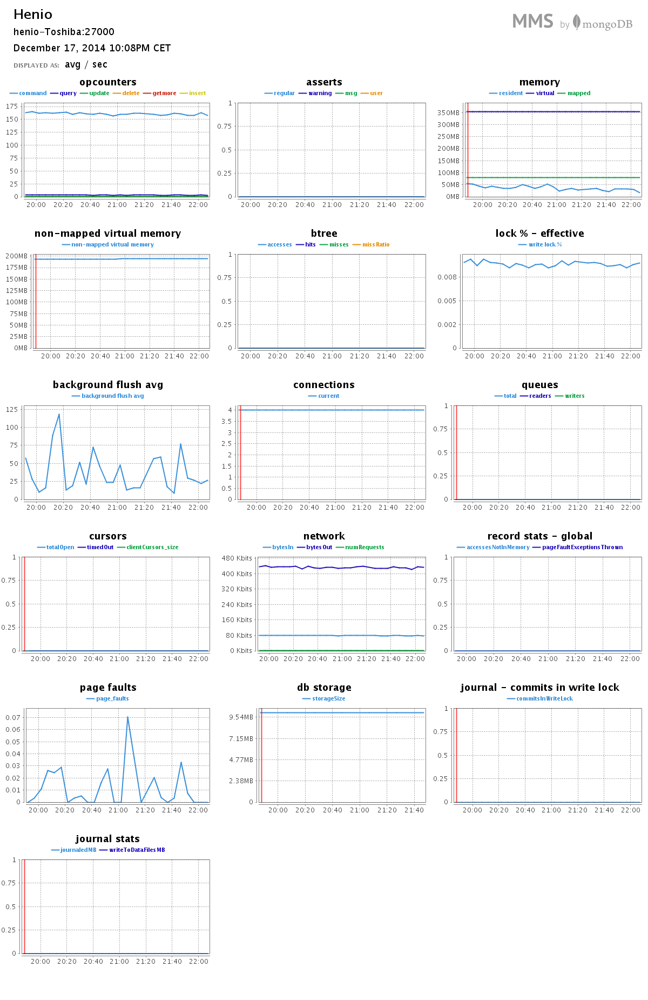
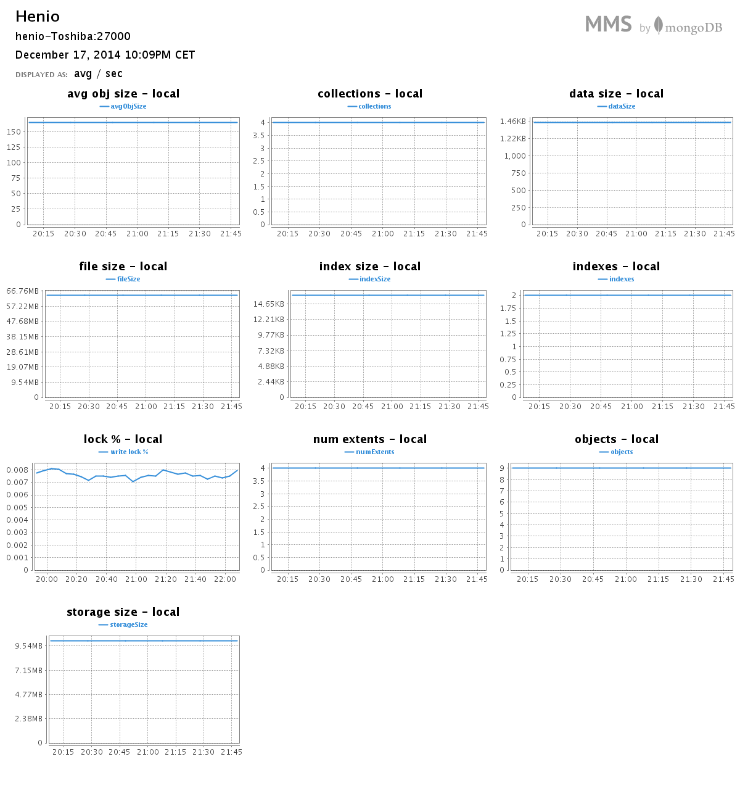
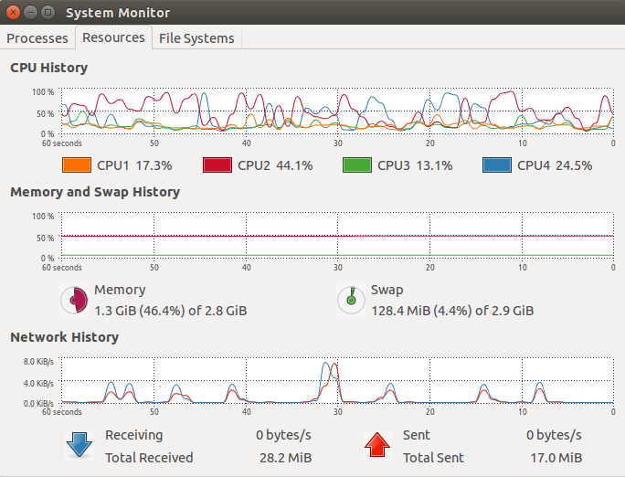
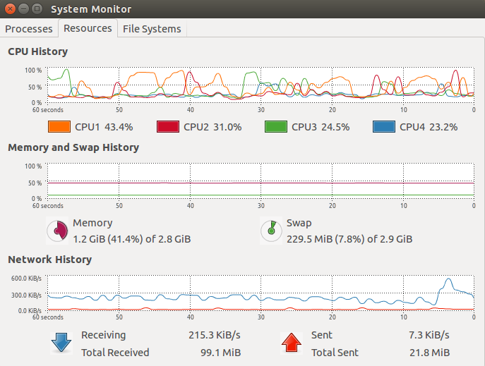
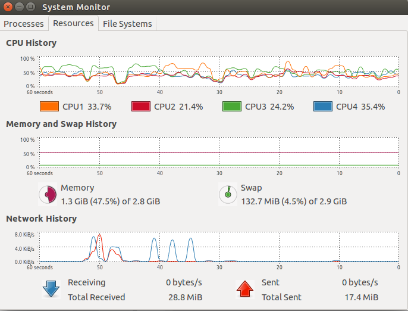

# Daniel Sienkiewicz (206358) NoSQL - MongoDB - EGZAMIN

- [Daniel Sienkiewicz (206358) NoSQL - MongoDB - EGZAMIN](#daniel-sienkiewicz-206358-nosql---mongodb---egzamin)
    - [Komputer](#komputer)
    - [Mongo MMS](#mongo-mms)
    - [Zadanie 1](#zadanie-1)
        - [Dane odnosnie bazy 1](#dane-odnosnie-bazy-1)
    - [Zadanie 2](#zadanie-2)
    - [Źródła](#zrodla)

## Komputer
* Computer: Toshiba C650 - 1C2
* CPU: Intel® Core™ i3 CPU M 350 @ 2.27GHz × 4 
* RAM: 3,072 (2,048 + 1,024) MB, DDR3 RAM (1066 MHz)
* Disk: 320 GB, 5,400 r/min
* OS: Ubuntu 14.04 LTS x64
* Data base: MongoDB version: 2.8.0 rc0

## Mongo MMS
Do bazy danych został podpięty system [Mongo MMS](http://mms.mongodb.com):

* username: sienkiewicz@project-midas.com
* group: Henio

## Zadanie 1
Przygotować funkcje map i reduce, które wyszukają wszystkie anagramy w pliku word_list.txt

Jako iż do mongo można [importować tylko pliki JSON, CSV oraz TSV](http://docs.mongodb.org/v2.2/reference/mongoimport/) należy przerobić nasz plik na np. CSV. Ja dodałem w pierwszej linii "name" jako nagłówek.

Import pliku do bazy:
~~~
$ time mongoimport --type csv -c text8 --file word_list.txt --headerline

real	0m0.856s
user	0m0.109s
sys		0m0.026s
~~~

Wykonanie funkcji map reduce - skrypt znajduje się [tutaj](scripts/zad1.js)
~~~
$ time mongo scripts/zad1.js

real	0m2.397s
user	0m0.051s
sys	0m0.016s
~~~

Wynik znajduje się w bazie mapped. W pliku [test.js](script/test.js) znajduje się skrypt, który [wypisuje](scripts/odp1.txt) wszytskie słowa, z których można ułożyć pozostałe wraz z ilością możliwych słów do ułożenia.
Przykładowe znalezione anagramy:
~~~
sachet
lacier
iceman
packer
racket
caller
camels
cleans
alcove
carpel
claret
cleats
creams
oceans
~~~

### Dane odnosnie bazy 1

## Zadanie 2
Przygotować funkcje map i reduce, które wyszukają najczęściej występujące słowa z Wikipedia data PL aktualny plik z artykułami, ok. 1.3 GB

Należy na początku przekształcić plik [XML do pliku CSV](scripts/XMLParser/src)
~~~
Time: 9,63595 min
~~~

Następnie usuwamy zbędne puste linie
~~~
$ time sed '/^$/d' wiki.txt > wikiData.txt
real	3m28.333s
user	0m53.555s
sys	0m12.665s
~~~

Import pliku do bazy:
~~~
$ time mongoimport --type csv -c wikipedia --file wikiData.txt --headerline
real	45m56.071s
user	20m22.852s
sys	6m7.543s
~~~

Rozmiar bazy po imporcie: ~15,5 GB

Wykonanie funkcji map reduce - skrypt znajduje się [tutaj](scripts/zad2.js)
~~~
$ mongo scripts/zad2.js
Czas: ~12h 32 min
~~~

Wynik znajduje się w bazie countsData. Najczęściej występujące słowa to:
~~~
> db.countsData.find().sort({value:-1}).limit(3)
{ "_id" : "w", "value" : { "count" : 20292468 } }
{ "_id" : "i", "value" : { "count" : 5780516 } }
{ "_id" : "a", "value" : { "count" : 5407771 } }
~~~

### Źródła:
* [Konwersja z XML do CSV](http://sax.sourceforge.net/)
* [Mongo Map Reduce tutorial](http://docs.mongodb.org/manual/tutorial/map-reduce-examples/)
